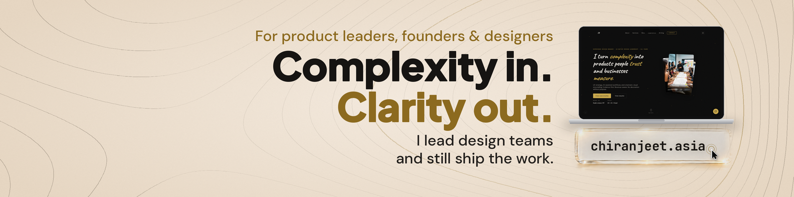
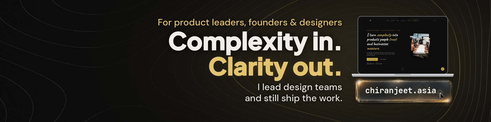
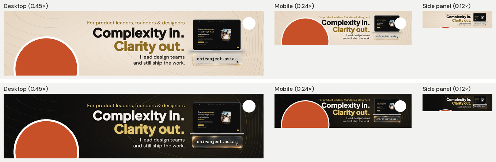

# Awesome LinkedIn Cover Design Skill

A Claude skill that designs your LinkedIn profile cover **with** you, not for you.

It asks the questions a good designer would ask first (goal, audience, proof, taste, how your profile actually renders), studies your inspirations, proposes scored options, iterates one change at a time, and checks every draft against measured desktop, mobile and side-panel views before you upload.




Built from a real 20+ round design engagement. Every rule in the skill exists because a draft failed without it.

---

## What you get

- Banner PNGs at **1584x396** and **3168x792 (2x)**, light and/or dark
- A copy set tested against four personas (hiring manager, client/founder, student, partner)
- 2 to 3 scored layout options with a recommendation
- A **view simulation sheet** showing your banner with your profile photo and LinkedIn's UI icons in desktop, mobile and side-panel views



---

## Requirements

| Requirement | Needed? | Notes |
|---|---|---|
| Claude with Skills | **Required** | Skills are available on Claude Free, Pro, Max, Team and Enterprise plans, and in Claude Code and the API with the code execution tool. See [Use skills in Claude](https://support.claude.com/en/articles/12512180-use-skills-in-claude). |
| Code execution and file creation | **Required** | Claude renders the banner, runs the safe-zone simulator and exports PNGs with Python (Pillow). Enable it in Claude's settings. |
| Model | **Recommended: Claude Opus 5.5** | No hard minimum. The skill was built and tested on Opus 5.5. Multi-round visual critique and layout judgement benefit from a frontier model; smaller models can run the intake but give weaker design feedback. |
| Image-generation connector | Optional | Only needed for photoreal background plates (for example a 3D glass URL field with real refraction). Without one, Claude builds the whole banner in code: patterns, typography, device mockups and gradients. You can also bring a background from any image tool. |
| Web access | Optional | Lets Claude pull colours and fonts from your website so the banner matches it. |

What you should have ready:
- 2 or more banners, sites or images you like, and why
- Your website URL, brand colours or fonts (if any)
- Screenshots of your current LinkedIn profile on **desktop and mobile**
- Any credential you can prove (years, launches, clients, recognitions)

---

## Install

**Claude (web, desktop, mobile)**
1. On this repo's page, click **Code > Download ZIP** and unzip it.
2. Zip just the `skill/linkedin-cover-copartner` folder (on macOS: right-click the folder > Compress).
3. In Claude, open **Customize > Skills**.
4. Click **+**, then **Create skill**, then **Upload a skill**, and choose that ZIP.
5. Make sure the skill is toggled on.

**Claude Code**
Copy the `skill/linkedin-cover-copartner` folder into your skills directory (for example `~/.claude/skills/`).

---

## How to use it, step by step

The skill triggers on any banner or cover request. You can also name it directly.

### 1. Start the session
> Use the linkedin-cover-copartner skill. I want a new LinkedIn cover. I'm a product designer moving into leadership.

Claude replies with the first 3 intake questions (goal, audience, desired action). It will not design anything yet.

### 2. Answer the intake gates
Claude asks in batches of 3 across four gates:
- **Goal and audience** (hired, clients, partners, mentees)
- **Substance** (who you help, the result, a provable credential, where to send people)
- **Taste** (references and why, dislikes, brand assets, light/dark, a pattern that represents you)
- **Reality** (desktop and mobile screenshots of your profile)

> Here are two banners I like. The first because it's one bold sentence, the second because the pattern actually means something. I dislike stock photos and emoji. My site is example.com.

### 3. Review the reference analysis and brief
Claude breaks down each reference (message, pattern, proof, CTA, lesson) and states a 5 to 7 line brief. Confirm or correct it.

### 4. Lock the copy
Claude proposes 2 to 3 copy sets and a persona table showing how each audience would read them.

> Go with set 2, but the hook feels like a values statement. Make it say what I deliver.

### 5. Choose a layout
You get 2 to 3 scored directions (for example Bold Authority, Textured Minimalist, Portfolio Showcase), or you can share your own wireframe.

> Here's a rough wireframe. Treat the dark box as a placeholder for the hook, not a design element.

### 6. Refine, one change at a time
> Push the whole block right, add 50px between the text and the laptop, and make the hook bolder.

Claude reports exact before and after values and keeps approved elements fixed.

### 7. Verify on real views
Claude runs the simulator on every candidate. After you upload, send fresh screenshots:

> Here's how it looks on desktop, mobile and the side panel. Check it.

Claude re-measures your photo and icon positions and adjusts.

### 8. Export
> Final. Give me light and dark at 1x and 2x.

---

## One-shot starter prompt

If you prefer to start with everything in one message:

```
Use the linkedin-cover-copartner skill.
Goal: [get hired / win clients / partners / mentees]
Audience: [who must recognise themselves]
What I help with and the result: [one sentence]
Proof I can verify: [number + where it's documented]
Contact path: [website / Featured section / both as variants]
References I like and why: [attach 2+ images, one line each]
Brand: [site URL, colours, fonts], mode: [light / dark / both]
Attached: my profile screenshots on desktop and mobile.
Ask me anything missing before you design.
```

---

## Dos and don'ts the skill enforces

**Do**
- One message, very large. Proof and CTA quiet.
- A pattern that means something about your work, faded and seamless.
- Numbers that match your resume, headline and website.
- Offer "see Featured" as a contact path; it's one tap.

**Don't**
- "Click below": banners aren't clickable.
- Generic AI graphics that say nothing about you.
- Five ideas stacked into 396 pixels of height.
- Text under your profile photo or LinkedIn's edit/settings icons.
- Trusting "mobile shows the centre 60%". On the measured profile, mobile showed the full width with a much larger photo. Measure yours.

---

## Repository structure

```
skill/linkedin-cover-copartner/
├── SKILL.md                         workflow, gates, phases
├── references/
│   ├── intake-questions.md          question bank with option sets
│   ├── copy-framework.md            five pieces, hook tests, persona table, scoring rubric
│   ├── safe-zones.md                measured desktop / mobile / side-panel geometry
│   ├── visual-system.md             type scale, patterns, glass, cursor, mockups, plate prompts
│   └── lessons-learned.md           every rule and the round that taught it
└── scripts/
    ├── simulate_views.py            renders desktop, mobile and side-panel previews
    └── measure_from_screenshot.py   converts screenshot measurements to banner coordinates
examples/                            final banners and view simulations
```

### Scripts on their own

```bash
pip install pillow
python skill/linkedin-cover-copartner/scripts/simulate_views.py my_banner.png views.png
python skill/linkedin-cover-copartner/scripts/measure_from_screenshot.py 11 722 16 38 217 86
```

---

## Notes

- LinkedIn changes its layout. The safe-zone numbers are defaults measured in October 2026; the skill always prefers your own screenshots.
- The example banners are the author's own published cover.

## Author

Chiranjeet Banerjee · [chiranjeet.asia](https://chiranjeet.asia)

## License

MIT
